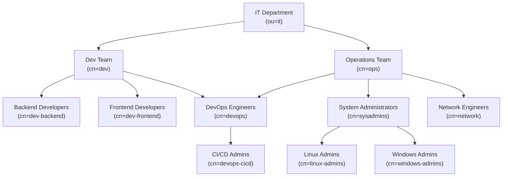

>[!bug] [Keycloak Issue #11752](https://github.com/keycloak/keycloak/issues/11752)
>This is still a feature (or bug) of Keycloak as of version **26.2.4**

When setting up LDAP federation in a Keycloak realm, one can configure it to synchronize users and groups from an external directory, such as Active Directory. This is often done to provide a central source of truth for user identities and access control across multiple applications.

You can create and configure group mappers that **import groups** and optionally **preserve their inheritance**, meaning child groups appear nested under parent groups in the Keycloak UI and APIs. This setup works seamlessly for simple directory structures, where groups have a clear single-parent hierarchy.

However, things become more complicated in enterprise ADs where **group nesting** is used heavily and **many groups appear under multiple parents** 
## The problem
Consider the following structure of an IT department in Active Directory:

If you were to create a `group-ldap-mapper` that tries to import `dev` or `ops` with all of their respective children in one go, e.g. with:

![[keycloak-group-ldap-mapper-ldap-filter.png]]
*and* preserved group inheritance: 

![[keycloak-group-ldap-mapper-preserve-group-inheritance.png]]
you would be met with the following error in the UI when attempting a sync:

![[keycloak-unknown-error.png]]
Upon further investigation, you'd find a stacktrace in the Keycloak logs with the following:
```log
2023-07-29 15:53:34,250 ERROR [org.keycloak.services.error.KeycloakErrorHandler] (executor-thread-42) Uncaught server error: org.keycloak.models.ModelException: Couldn't resolve groups from LDAP. Fix LDAP or skip preserve inheritance. Details: Group 'devops' detected to have multiple parents. This is not allowed in Keycloak. Parents are: [dev, ops]
```

As the error suggests, Keycloak does not like the fact that the `DevOps Engineers` group is a child of both `Dev Team` and `Operations Team`, causing it to error out and fail the sync.
## Workaround
To pull in all groups in the above department, you'd have to create two group mappers with Inheritance preserved:
1. A mapper that *excludes* the problem group and it's subtree
2. A mapper that only includes the problem group and it's subtree

There are two solutions for this:
1. A [[Preserving Inheritance of Multi-Parent Groups in LDAP Federation#Generic Solution|generic solution]] that works with any directory service by relying on `cn` pattern matching
2. A solution exclusive to [[Preserving Inheritance of Multi-Parent Groups in LDAP Federation#Microsoft Active Directory or Microsoft Entra ID (previously Azure Active Directory)|Microsoft offered Active Directories]] that makes use of built in matching rules
### Generic Solution
This just involves manually crafting mappers that exclude / include your group & subtree based on patterns in the `cn`. In the above example, we could make an *exclusive* `group-ldap-mapper` with the following filter that pulls in every group except for those in the `devops` subtree:
```sh
(!(cn=devops*)
```
and then an *inclusive* mapper with the following to pull in just the `devops` subtree:
```sh
(cn=devops*)
```

Notice how clean and simple this is because of our choice of naming the subgroups with prefixes that we can match. You'll notice that the groups under `ops` don't follow the same convention. So if you ever wanted to exclusively pull in only the `dev` group's subtree, you'd have to do this:
```sh
# exclusive filter
(&(!(cn=devops*))(!(cn=ops))(!(cn=sysadmins))(!(cn=linux-admins))(!(cn=windows-admins))(!(cn=network)))

# inclusive filter (can't just do dev* because of the devops group)
(|(cn=dev)(cn=dev-*))
```

Make sure you name things well! Although if you're getting to deep levels of group nesting you should probably be creating some more organisational units instead.
### Microsoft Active Directory or Microsoft Entra ID (previously Azure Active Directory)
>[!warning]
>Due to the recursive nature of this query it is generally slower than the [[Preserving Inheritance of Multi-Parent Groups in LDAP Federation#Generic Solution|generic solution]]. It also excludes groups that have no users. See the [[Preserving Inheritance of Multi-Parent Groups in LDAP Federation#Caveats|end of this section]] for more details. 

If your Keycloak's LDAP federation is using a Active Directory or Entra ID, then you can make use of the [LDAP_MATCHING_RULE_TRANSITIVE_EVAL](https://learn.microsoft.com/en-us/openspecs/windows_protocols/ms-adts/1e889adc-b503-4423-8985-c28d5c7d4887) extensible match (also known as `LDAP_MATCHING_RULE_IN_CHAIN`).

This matching rule, defined by the OID (Object Identifier) `1.2.840.113556.1.4.1941`, provides a method to recursively look up the ancestry of an object in AD. When coupled with the `memberOf` attribute, it allows AD to return **all groups** that are descendants of the target group.

For example, to get `ops` as well as all it's descendants we would use the following filter:
```sh
(&(objectClass=group)(cn=ops)(memberOf:1.2.840.113556.1.4.1941:=cn=ops,ou=it,dc=example,dc=com))
```
#### Caveats
As mentioned in the warning, this has some caveats relating to performance & what groups will be returned. The way this extension works under the hood when coupled with `memberOf` is as follows:
1. The AD looks at all users within the base domain specified in the Keycloak's LDAP Federation source:
   ![[keycloak-ldap-federation-users-dn.png]]
2. For **each user**, the AD looks at their `memberOf` attribute to see what group they are a member of. It then visits **each of those groups** and checks their `memberOf` attribute
3. This happens until either the *target* group is met (`cn=ops,ou=it,dc=example,dc=com` above) or all options are exhausted
4. All groups in a path that led to the target are part of the subtree and returned

As you can imagine, if the base domain has a large amount of users with deeply nested groups, this query will take a long time. Also, since this query relies on starting at users, any group without users will be missed.

For Keycloak, there isn't much we can do, but when building custom scripts or applications outside of Keycloak, it would be better to write your own function that traverses *from* the target and down via each group's `member` attributes until hitting a user or exhausting all options.

